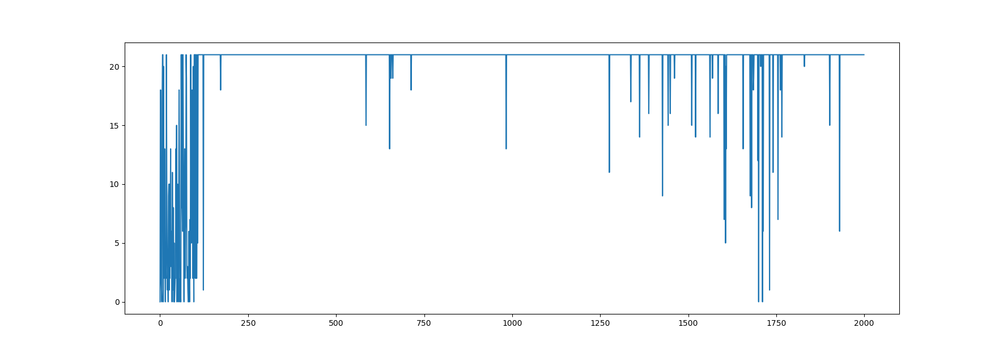
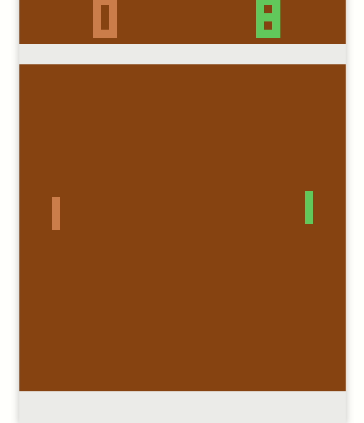

# Single-Agent RL Atari Pong

Atari Pong Multi-Agent Classic Reinforcement Learning (no Deep RL) as course project of Distributed Artificial Intelligence, University of Modena and Reggio Emilia, Italy

# Observation preprocessing

The screen pixel observation is downsampled on rows and columns by a factor of 3 and 2 respectively. Reaching a shape of 53 x 80.
I'm considering just the pixels from 35 to 92 aka cutting out the side walls and the scores to reduce the amount of pixels.

# Q Learning

## Past state and past action (maybe in the docs)

In the q-learning formula it's necessary to use the past action and state to compute.
In the very first iteration (for each agent) i don't have any past variables, so i initialized them as empty values.

## Q Tables

The states are calculated considering the resized screen values (described in the previous section) as:

- **Cooperative agent's states** => 53\*80 (ball positions) \* 53 (agent_0) \* 53(agent_1) \* 6 (n_actions)= 71 460 960 states \* 4 byte (float32) = 286 MB

- **Coompetitive agent's states** => 53\*80 (ball positions) \* 53 (agent_0) \* 6 (n_actions) = 1 348 320 states \* 4 byte (float32) = 5.4 MB

  I made the assumption that i don't need to know the position of the competitor in order to win the game, indeed i counted the states only for agent_0. This assumption make the game partial observable.

  It is possible a fully observable settings for the game (the states equal to the ones of the cooperative situation).
  The RL could extract smarter behaviours indeed, however the convergence will be harder bacause of the **sparsity** and the greater size of the **qtables** (~98% bigger).

## Rewards

In order to address the **sparsity** problem, I implemented a **gaussian smoothing** on the reward signal.
Since exists a close relationship between the states and the screen's pixels, it make sense to spead the reward spatially by smoothing (e.g. if a specific pixel is a great location to catch the ball than it's reasonable that the near ones are a good positions too).

# Emergent behaviours

## A good throw is useless

This behaviour emerge during the match of Q-Learning vs Random agent.

The Q-Learning agent don't need to learn to throw the ball since it will come anyway shortly from the random agent. The learning agent focus only on a good racket's placing which lead him to several wins after just 200 episodes

Q-Learning agent's scores during 2000 episodes

## A good throw is important (Q-Learning vs Q-Learning)

## Shy replies (Q-Learning vs Q-Learning)

# Petting zoo warning

When termination or truncation became true, ensure that the action is setted to None otherwise an Exception comes up.
