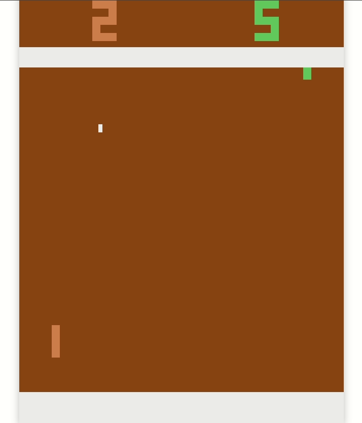
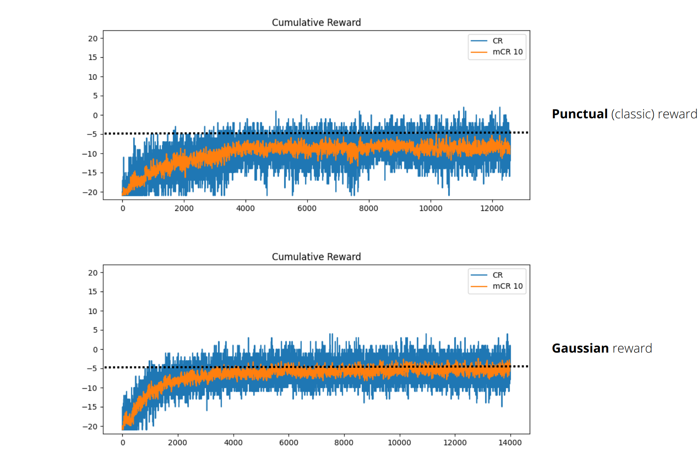
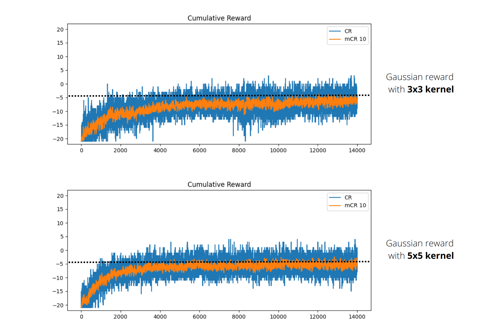
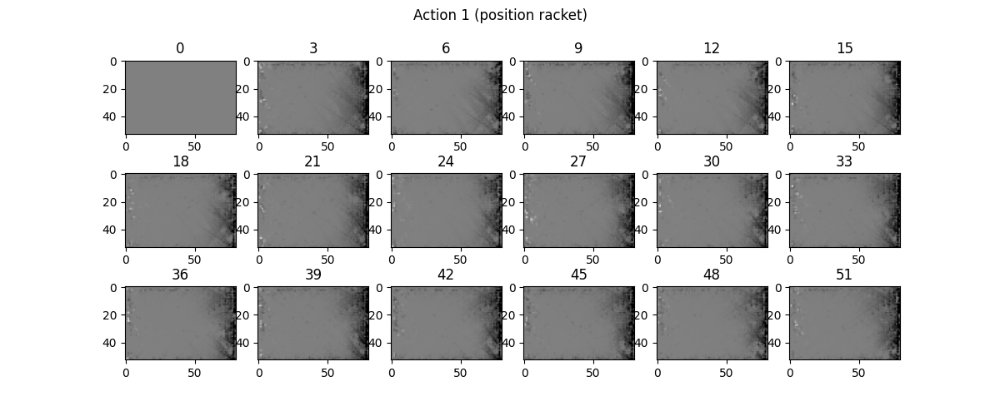
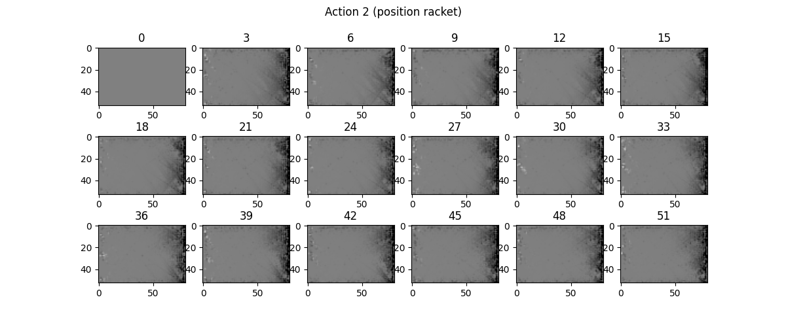
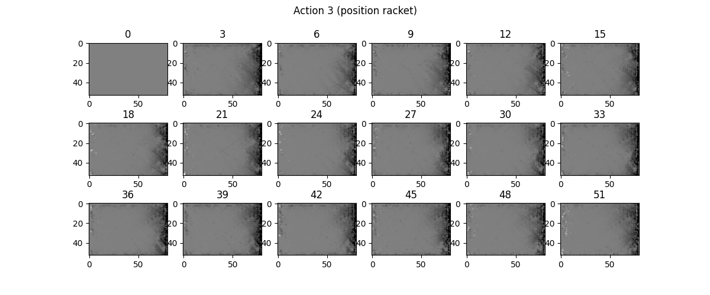
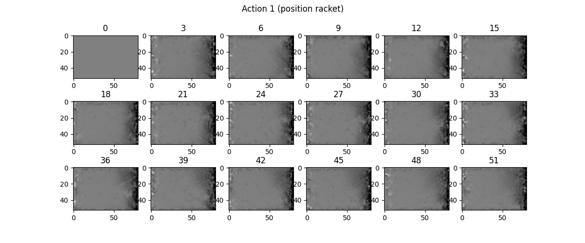
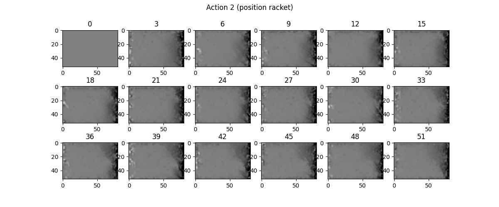

# Single-Agent RL Atari Pong

Atari Pong Single-Agent Classic Reinforcement Learning (no Deep RL) as course project of Distributed Artificial Intelligence, University of Modena and Reggio Emilia, Italy

<a href="https://www.canva.com/design/DAFbB3ySp6c/PZjROScCD669O0PH3GT8-A/view?utm_content=DAFbB3ySp6c&utm_campaign=designshare&utm_medium=link&utm_source=publishsharelink">:bar_chart: Here the slides of the presentation :bar_chart:</a>

# Observation preprocessing

The screen pixel observation is downsampled on rows and columns by a factor of 3 and 2 respectively. Reaching a shape of 53 x 80.
I'm considering just the pixels from 35 to 92 i.e. cutting out the side walls and the scores to reduce the amount of pixels.

# Q Learning

The states are calculated considering the resized screen values (described in the previous section) as:

 $$53*80 (ball positions) * 53 (agent) * 6 (n\_actions) = 1 348 320 (states) * 4 (byte) = 5.4 MB$$

  I made the assumption that i don't need to know the position of the competitor in order to win the game, indeed i counted the states only for agent_0. This assumption make the game partial observable.

  In this project I invesigated the RL potentials regarding the extraction of smart behaviours. I focused mainly on the hard convergence problem due to **sparsity** i.e. the **qtables** are big. In order to tackle this problem I experimented the effects of [gaussian reward](#gaussian-rewards) (smoother reward) and qtable initialization.

## Gaussian Rewards

In order to address the **sparsity** problem, I implemented a **gaussian smoothing** on the reward signal.
Since exists a close relationship between the states and the screen's pixels, it make sense to spead the reward spatially by smoothing (e.g. if a specific pixel is a great location to catch the ball than it's reasonable that the near ones are a good positions too).

It shows that the gaussian reward converge faster to a defined threshold. mCR10 is the mean over the last 10 steps of the cumulative reward signal.

### Reward kernel: 3x3 vs 5x5

It shows that the 5x5 reward converge faster than the 3x3. mCR10 is the mean over the last 10 steps of the cumulative reward signal.

### 3x3 Kernel
The following images show the qtable state for each action of the pong racket of a 3x3 smoothed reward training.

The title of each subplots is define the coordinate position of the racket when the action is performed. The subplot itself shows the ball position. Basically It tells whether is good (white) of bad(black), for the racket, to be in that position (subplot number title) and doing that action. 

### 5x5 Kernel

The following images show the qtable state for each action of the pong racket of a 5x5 smoothed reward training.

The image meaning is the same described in the [3x3 reward](#3x3-kernel) section.

